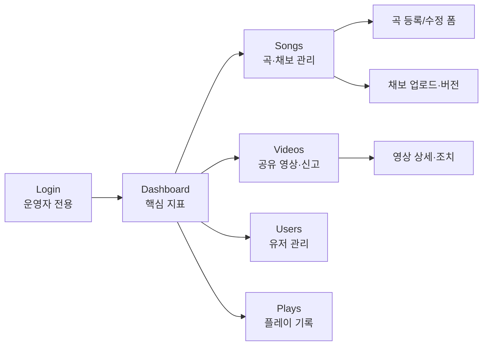
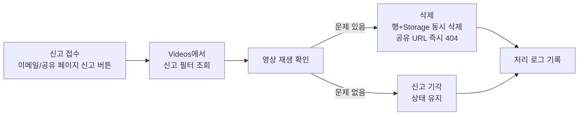

# CatchRhy Admin — 관리자 페이지 PRD

> **"운영자가 DB를 직접 만지지 않게 한다."**
> CatchRhy 클로즈드 출시를 위한 내부 관리자 페이지 기획 문서

| 항목 | 내용 |
|---|---|
| 문서 버전 | v1.0 |
| 작성일 | 2026-07-07 |
| 문서 목적 | 관리자 페이지(Admin Console) 개발 착수를 위한 요구사항 정의 |
| 대상 독자 | 개발자, PM, 서비스 운영 담당 |
| 상위 문서 | `prd.md` (기본 PRD), `prd-detail.md` (MVP 상세 PRD) |
| 상태 | Draft → 리뷰 후 개발 착수 |

---

## 1. Summary

CatchRhy의 곡·채보 등록, 공유 영상 신고 처리, 유저·플레이 기록 관리를 위한 **내부 운영자용 관리자 페이지**를 만든다. 지금은 운영 작업 전부를 Supabase Studio에서 DB를 직접 조작해야 하며, 클로즈드 출시(Phase 1 Week 9~10) 후에는 이 방식으로 신고 대응·콘텐츠 운영이 불가능하다. 이 문서는 출시 전 반드시 필요한 최소 운영 도구의 범위를 정의한다.

## 2. Contacts

| 이름 | 역할 | 비고 |
|---|---|---|
| PM / 게임 기획 | Product Owner · 콘텐츠 운영 | 본 문서 작성, 곡·채보 등록의 실사용자 |
| Backend Engineer | Admin API (Spring Boot) + 권한 설계 | 인증·감사 로그 담당 |
| Frontend Engineer | Admin UI (Next.js) | 본 제품 웹앱과 코드베이스 공유 여부 결정 참여 |
| 서비스 운영 담당 | 신고 처리 · 유저 조치 | 출시 후 일일 운영의 실사용자 (초기에는 PM 겸임) |

## 3. Background

### 3.1 현재 상태

- 곡·채보 데이터는 개발자가 **Supabase Studio에서 SQL과 Storage를 직접 조작**해 넣는다
- 채보 JSON은 로컬 스크립트(`npm run gen-charts`)로 만들고 손으로 업로드한다
- 유저·플레이 기록·영상에 대한 운영 조치 수단이 **아예 없다**

### 3.2 왜 지금인가

1. **콘텐츠 제작 주간이 다가온다** — 로드맵상 Week 8에 곡 5~8개의 채보 제작·밸런싱이 몰려 있다. 곡 하나를 넣고 확인하는 반복 작업이 DB 직접 조작이면, 밸런싱 반복 속도가 나오지 않는다
2. **공개 공유 페이지가 생긴다** — 결과 영상은 `catchrhy.app/v/{slug}` 공개 URL로 퍼진다. 부적절한 영상(선정성·타인 노출 등)이 공개된 순간부터 **삭제 대응은 선택이 아니라 의무**다. 지금은 신고가 들어와도 지울 방법이 SQL뿐이다
3. **라이선스 리스크(R3)의 방어선** — 상세 PRD는 `songs.license_note`에 음원 출처를 기록하도록 정했다. 등록 화면에서 이 입력을 **강제**하지 않으면 기록 누락이 반드시 생기고, 이는 서비스 중단급 리스크다
4. **Go/No-Go 판정 기간** — 출시 후 4주간 H1~H3 가설 지표를 보고 Phase 2 진행을 판정한다. 지표 확인이 쉬워야 판정이 굴러간다

### 3.3 왜 이제 가능한가

본 제품의 인증(Supabase Auth)·API(Spring Boot)·DB 스키마(11장)가 이미 확정되어 있다. 관리자 페이지는 이 위에 화면과 권한만 얹으면 된다.

## 4. Objective

### 4.1 목표

**클로즈드 출시 시점에, 개발자 없이도 운영자가 콘텐츠 등록과 신고 대응을 할 수 있는 상태를 만든다.**

- **회사(팀) 이익**: 개발자가 운영 작업에서 해방되어 Phase 1 개발에 집중. DB 직접 조작으로 인한 사고(잘못된 UPDATE, 라이선스 기록 누락) 원천 차단
- **고객(유저) 이익**: 부적절 공유 영상의 빠른 삭제 → 안전한 공유 환경. 곡 밸런싱 반복이 빨라져 더 나은 채보 품질
- **전략 정렬**: MVP의 존재 이유는 H1~H3 가설 검증이다. Admin은 검증 기간의 운영 비용을 최소로 눌러, 팀이 지표와 개선에 집중하게 한다

### 4.2 Key Results

| # | Key Result | 목표치 | 측정 방법 |
|---|---|---|---|
| KR1 | 곡 1개 등록(메타+음원+채보+미리듣기 확인+활성화) 소요 시간 | **10분 이내** (현재 30분+, 개발자만 가능) | 운영자 셀프 계측, 콘텐츠 주간에 확인 |
| KR2 | 신고 접수 → 영상 비공개/삭제 처리 시간 | **24시간 이내 100%** | 신고 처리 로그 |
| KR3 | 라이선스 출처(`license_note`) 기록률 | **활성 곡 기준 100%** | 등록 폼 필수값 강제 + 주간 점검 |
| KR4 | 출시 후 운영 목적의 직접 DB 조작 건수 | **0건** | 팀 셀프 리포트 |

## 5. Market Segment(s)

관리자 페이지의 "시장"은 내부 운영자다. 인구통계가 아니라 **해야 하는 일(Job)**로 정의한다.

| 세그먼트 | 해야 하는 일 (Job) | 현재의 고통 |
|---|---|---|
| **콘텐츠 운영자** (PM 겸임) | 곡·채보를 넣고, 미리 확인하고, 밸런싱을 반복한다 | 개발자를 거쳐야만 데이터를 만질 수 있어 반복 주기가 길다 |
| **서비스 운영자** (초기 PM 겸임) | 신고된 영상을 확인하고 내리고, 문제 유저를 조치한다 | 조치 수단이 없다. 출시 후 대응 불가 상태 |
| **개발자** | 비정상 데이터(어뷰징 점수 등)를 정정한다 | SQL 직접 조작은 실수 한 번이 사고가 된다 |

**제약 조건**

- 운영 인원은 2~3명, 모두 내부 팀원. 외부 공개 없음
- 클로즈드 출시 일정 안에 만들어야 하므로 개발 여력은 극히 제한적 — **화려함 금지, 최소 기능**
- 모바일 대응 불필요 (데스크톱 브라우저 전용)

## 6. Value Proposition(s)

| 대상의 일 (Job) | 얻는 것 (Gain) | 피하는 고통 (Pain Relieved) |
|---|---|---|
| 곡·채보 등록과 밸런싱 반복 | 폼 입력 + 파일 업로드만으로 곡 활성화. 등록 즉시 게임에서 확인 | 개발자 대기 시간, SQL 실수, Storage 경로 오타 |
| 신고 영상 처리 | 목록에서 영상 확인 → 버튼 한 번으로 비공개/삭제 (Storage 객체까지 함께 삭제) | 신고 방치로 인한 신뢰 훼손, 수동 삭제 누락 |
| 라이선스 관리 | 등록 시 출처 입력이 강제되어 기록이 항상 완전함 | 출처 불명 곡으로 인한 법적 리스크(R3) |
| 어뷰징 기록 정정 | 근거(점수·정확도)를 화면에서 보고 안전하게 삭제 | 프로덕션 DB 직접 조작의 사고 위험 |
| 가설 판정 | 핵심 퍼널 숫자를 한 화면에서 확인 | GA4를 매번 파고드는 비용 |

**경쟁 대안과의 비교**: 대안은 "Supabase Studio를 계속 쓰는 것"이다. Studio는 무료지만 ① 라이선스 입력을 강제할 수 없고 ② 영상 삭제 시 DB 행과 Storage 객체를 사람이 둘 다 기억해서 지워야 하며 ③ 운영자에게 프로덕션 DB 전체 권한을 줘야 한다. Admin은 이 세 가지를 구조적으로 막는다.

## 7. Solution

### 7.1 UX / 화면 구조

**정보 구조 (IA)**

**핵심 화면**

| 화면 | 구성 | 핵심 동작 |
|---|---|---|
| **Dashboard** | 오늘/누적: 가입, 플레이 수, 완료율, 공유 클릭. H1~H3 대비 현황 카드. GA4 바로가기 링크 | 숫자 확인만. 조작 없음 |
| **Songs 목록** | 곡 테이블: 재킷, 제목, 아티스트, BPM, 난이도별 채보 유무·버전, 라이선스 기록 여부 배지, 활성/비활성 토글 | 곡 추가, 활성/비활성 전환 |
| **곡 등록/수정 폼** | 메타 입력(제목·아티스트·BPM·길이) + 파일 업로드(재킷·음원·미리듣기) + **라이선스 출처(필수값)** | 저장 시 유효성 검사. 라이선스 미입력 시 저장 불가 |
| **채보 업로드** | 난이도별 채보 JSON 업로드 + 포맷 검증(16.1 스키마) + 노트 수·y범위(0.45~0.73) 자동 점검 + 버전 이력 | 업로드 → 검증 통과 시 새 버전으로 반영 |
| **Videos 목록** | 공유 영상 테이블: 미리보기, 업로더, 곡, 생성일, 상태(공개/비공개), 신고 여부 필터 | 영상 재생 확인 → 비공개 전환 or 삭제(DB 행 + Storage 객체 동시 삭제) |
| **Users 목록** | 유저 검색(닉네임/이메일), 가입일, 플레이 수, 업로드 영상 수 | 닉네임 강제 변경(부적절 닉네임), 계정 정지/삭제 |
| **Plays 목록** | 유저·곡별 기록 조회, 점수·정확도 이상치 정렬 | 비정상 기록 삭제 (개인 베스트 재계산은 조회 기반이므로 자동 반영) |

**대표 플로우 — 신고 영상 처리**

### 7.2 Key Features

우선순위는 MoSCoW. **Must는 "이것 없이 클로즈드 출시 운영이 가능한가?"를 통과하지 못한 것만 남겼다.**

#### Must Have

| ID | 기능 | Acceptance Criteria |
|---|---|---|
| **AD-01** | **운영자 전용 접근 제어** — 지정된 운영자 계정만 Admin 접근 | Given 일반 유저 계정으로, When Admin URL에 접근하면, Then 403이 표시되고 어떤 데이터도 조회되지 않는다. 운영자 목록은 DB의 role 값으로 관리한다 |
| **AD-02** | **곡 등록/수정/비활성화** — 메타+파일 업로드, 라이선스 필수 | Given 곡 등록 폼에서, When 라이선스 출처를 비우고 저장하면, Then 저장이 거부되고 사유가 표시된다. When 정상 저장하면, Then 게임의 곡 목록 API에 즉시 반영된다 |
| **AD-03** | **채보 업로드 + 검증** — JSON 스키마·규칙 자동 점검, 버전 관리 | Given 채보 업로드 시, When 포맷 오류 또는 노트 y범위(0.45~0.73) 위반이 있으면, Then 업로드가 거부되고 위반 항목이 줄 단위로 표시된다. 통과 시 버전이 +1 되고 이전 버전 이력이 남는다 |
| **AD-04** | **공유 영상 조회/비공개/삭제** — 삭제 시 Storage 객체 동시 제거 | Given 영상 상세에서, When 삭제를 확정하면, Then DB 행과 Storage 객체가 함께 삭제되고 공유 URL(`/v/{slug}`)은 즉시 404가 된다 |
| **AD-05** | **유저 조치** — 닉네임 강제 변경, 계정 정지/삭제 | Given 유저 상세에서, When 계정을 삭제하면, Then 상세 PRD 8.9의 탈퇴 처리와 동일하게 계정·기록·영상이 삭제된다 |
| **AD-06** | **조치 감사 로그** — 모든 쓰기 작업의 기록 | Given 어떤 조치든 실행되면, Then 누가·언제·무엇을·어떤 대상에 했는지가 로그 테이블에 남고 Admin에서 조회된다 |

#### Should Have (출시 직후 2주 내)

| ID | 기능 | 내용 |
|---|---|---|
| **AD-07** | **대시보드** — 핵심 퍼널 숫자 카드 | 가입·플레이·완료율·공유 클릭의 일별 추이. 정밀 분석은 GA4/BigQuery 링크로 위임 |
| **AD-08** | **플레이 기록 관리** — 이상치 정렬·삭제 | 점수 상한 초과 등 서버 검증(422)을 우회한 기록의 사후 정리 |
| **AD-09** | **공유 페이지 신고 버튼** — 유저 신고 접수 경로 | 공유 페이지에 신고 버튼 추가 → Admin 신고 필터에 적재 (본 제품 측 1개 화면 수정 포함) |

#### Won't Have (명시적 제외)

| 기능 | 제외 사유 |
|---|---|
| 다단계 권한(RBAC), 운영자 초대 플로우 | 운영자 2~3명. role 값 하나로 충분 (YAGNI) |
| 채보 비주얼 에디터 | 채보 제작은 로컬 스크립트로 충분. 에디터는 UGC(Phase 4) 과제 |
| 통계·BI 화면 고도화 | GA4 + BigQuery가 이미 있다. Admin은 요약 숫자만 |
| 공지/배너, 점검 모드, 푸시 발송 | 클로즈드 테스트(100~500명)에서는 커뮤니티 채널(디스코드 등)로 대체 |
| 자동 콘텐츠 모더레이션(AI 검수) | 신고 기반 수동 처리로 충분한 규모. 공개 베타에서 재검토 |

### 7.3 Technology

본 제품 스택을 그대로 재사용한다. 새 인프라 없음.

| 항목 | 선택 | 근거 |
|---|---|---|
| UI | 본 제품 Next.js 앱의 `/admin` 라우트 그룹 | 별도 앱 배포·인증 중복 회피. 코드 스플리팅으로 게임 번들에 영향 없음 |
| 인증 | Supabase Auth 동일 계정 + `profiles.role = 'admin'` | 운영자 지정은 DB 값 1개. Admin API는 JWT의 role 검증 |
| API | Spring Boot에 `/api/admin/*` 추가 | 모든 쓰기 작업은 서버 검증 경유. RLS와 이중 방어 |
| 감사 로그 | `admin_logs` 테이블 신설 (admin_id, action, target, payload, created_at) | AD-06. 테이블 1개로 충분 |
| 영상 삭제 | Admin API가 DB 행 삭제 + Storage 객체 삭제를 트랜잭션 처리 | 상세 PRD 11.2의 삭제 정책(soft delete 없음)과 일치 |
| 배포 | 본 제품과 동일 (Vercel + Cloud Run) | 추가 비용 0 |

### 7.4 Assumptions

| # | 가정 | 틀렸을 때의 영향 | 검증 방법 |
|---|---|---|---|
| A1 | 클로즈드 규모(100~500명)에서 신고는 주 수 건 수준이다 | 신고 폭증 시 수동 처리 불가 → 자동 필터 앞당김 | 출시 후 신고 건수 계측 |
| A2 | 채보 밸런싱 반복은 Admin 업로드 주기로 충분히 빠르다 | 반복이 느리면 로컬 미리보기 도구 별도 필요 | 콘텐츠 주간(Week 8) 운영자 피드백 |
| A3 | 운영자 2~3명에게 단일 admin 권한이면 충분하다 | 권한 사고 발생 시 RBAC 앞당김 | 감사 로그 리뷰 |
| A4 | `/admin` 라우트 동거가 게임 성능에 영향을 주지 않는다 | 번들 오염 시 별도 앱으로 분리 | 빌드 사이즈 확인 |

## 8. Release

정확한 날짜 대신 본 제품 로드맵(Phase 1 Week 기준) 상대 시점으로 표기한다.

### Release 1 — 출시 전 필수 (본 제품 Week 7~8과 병행, 약 1.5~2주)

콘텐츠 제작 주간(Week 8)에 맞춰 **곡·채보 관리가 먼저** 나와야 한다.

- AD-01 접근 제어 → AD-02 곡 관리 → AD-03 채보 업로드 (이 순서로 순차 릴리즈)
- AD-06 감사 로그 (쓰기 API와 동시 구현이 가장 저렴)

### Release 2 — 클로즈드 출시 시점 (Week 9~10)

유저가 생기는 순간 필요한 것들.

- AD-04 영상 조치, AD-05 유저 조치

### Release 3 — 출시 후 2주 내

- AD-07 대시보드, AD-08 플레이 기록 관리, AD-09 신고 접수 경로

### 이후 (Phase 2 판정 이후 재논의)

- 공개 베타 규모에서의 모더레이션 자동화, 곡 라인업 확장에 따른 일괄 등록, 리더보드 운영 도구

---

*본 문서의 모든 기능 판단 기준은 "클로즈드 출시 운영에 이것이 없으면 무엇이 멈추는가"이다. — CatchRhy Team*
