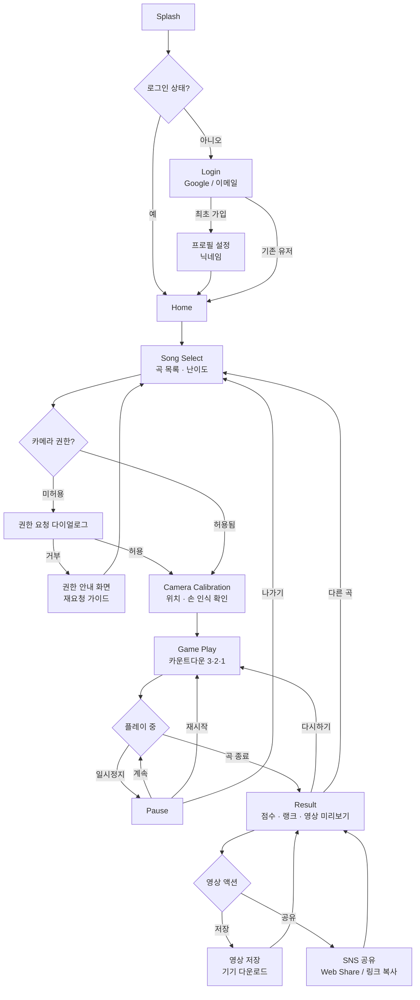
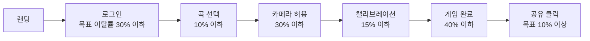
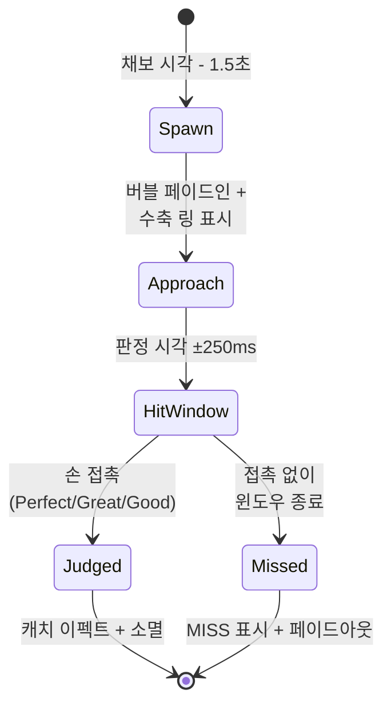
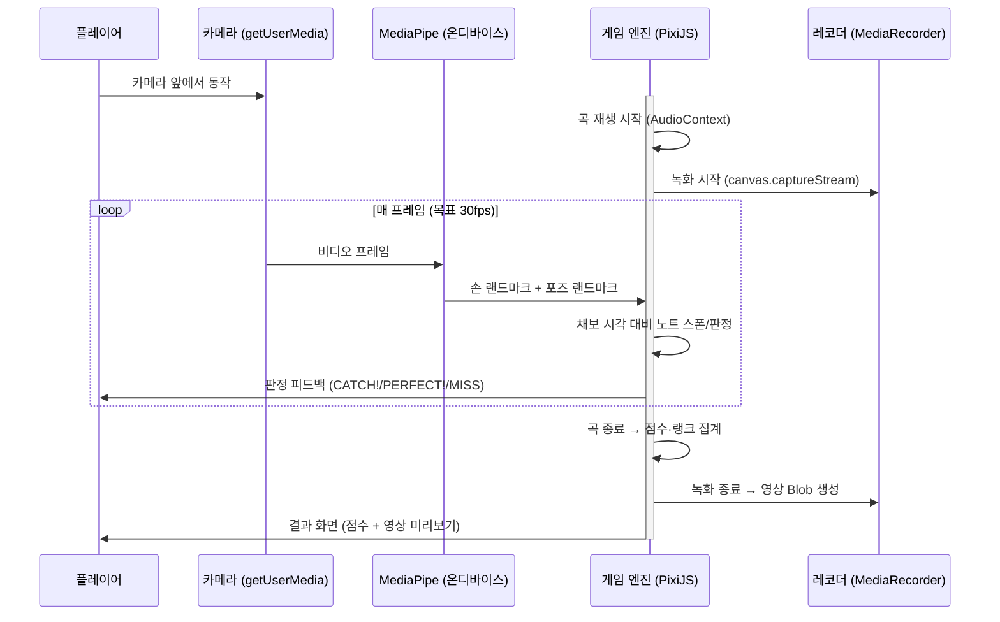
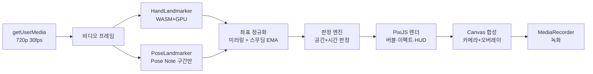
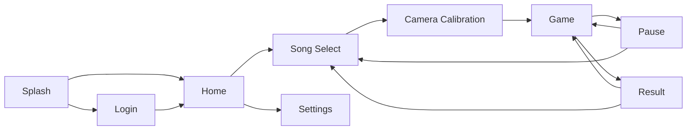
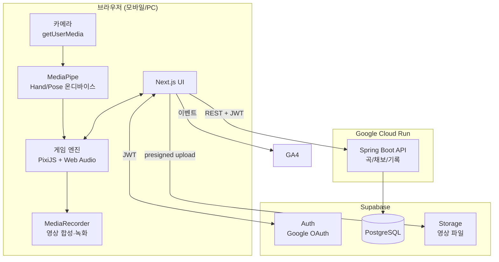
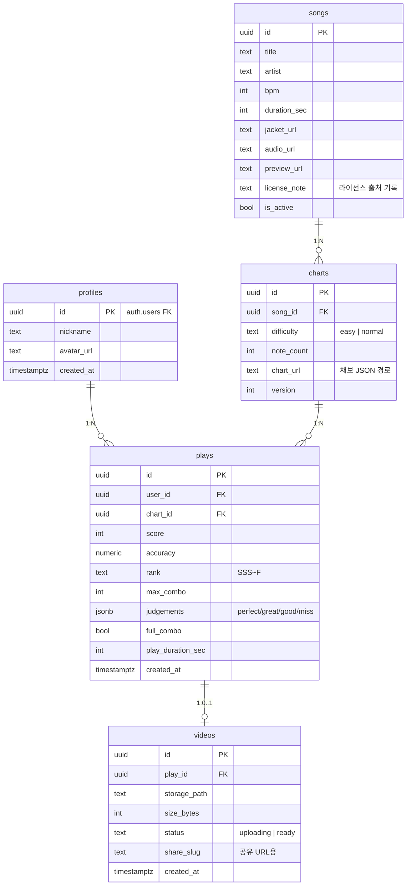
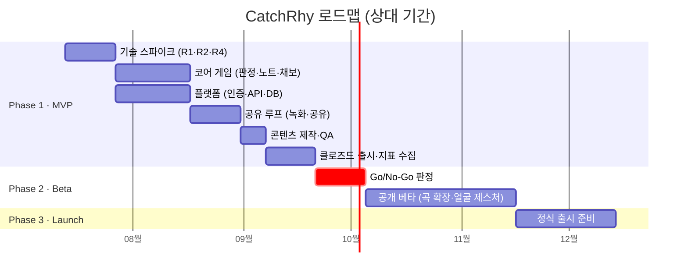

# CatchRhy — 상세 PRD (MVP)

> **Catch the Rhythm.**
> 카메라가 컨트롤러가 되는 AI 리듬게임 — MVP 개발용 실무 명세서

| 항목 | 내용 |
|---|---|
| 문서 버전 | v1.0 |
| 작성일 | 2026-07-07 |
| 문서 목적 | MVP 개발 착수를 위한 상세 제품 요구사항 정의 |
| 대상 독자 | 개발자, 디자이너, PM |
| 상위 문서 | `prd.md` (CatchRhy 기본 PRD), `CatchRhy_PRD.md` |
| 참고 자료 | `ref.png` (인게임 화면 레퍼런스) |
| 상태 | Draft → 리뷰 후 개발 착수 |

### Contacts

| 이름 | 역할 | 비고 |
|---|---|---|
| PM / 게임 기획 | Product Owner | 본 문서 작성 및 스코프 관리 |
| Frontend Engineer | 게임 클라이언트 (Next.js + PixiJS + MediaPipe) | 판정 엔진·렌더링 담당 |
| Backend Engineer | API 서버 (Spring Boot) + Supabase | 인증·데이터·스토리지 담당 |
| Designer | UI/UX | ref.png 톤앤매너 기준 |

---

## 目次 (Table of Contents)

1. [Executive Summary](#1-executive-summary)
2. [MVP Goals](#2-mvp-goals)
3. [Target Users](#3-target-users)
4. [User Flow](#4-user-flow)
5. [Core Gameplay](#5-core-gameplay)
6. [Gesture Detection](#6-gesture-detection)
7. [Functional Requirements](#7-functional-requirements)
8. [Screen Specification](#8-screen-specification)
9. [Technical Stack](#9-technical-stack)
10. [API Overview](#10-api-overview)
11. [Database](#11-database)
12. [Analytics](#12-analytics)
13. [Risks](#13-risks)
14. [Roadmap](#14-roadmap)
15. [Out of Scope (명시적 제외)](#15-out-of-scope-명시적-제외)
16. [Appendix](#16-appendix)

---

## 1. Executive Summary

### 1.1 프로젝트 소개

**CatchRhy**는 스마트폰/PC의 **카메라를 컨트롤러로 사용하는 웹 기반 AI 리듬게임**이다.

플레이어는 전면 카메라 앞에서 음악의 비트에 맞춰 화면에 떠오르는 **버블 노트를 손으로 캐치**하고, 특정 구간에서는 **지정된 포즈**를 취하며 플레이한다. 게임이 끝나면 플레이 영상이 자동으로 저장되어 TikTok / Instagram Reels / YouTube Shorts에 바로 공유할 수 있다.

- 설치 없음: 브라우저에서 URL 접속만으로 즉시 플레이 (Web MVP)
- 별도 기기 없음: 카메라만 있으면 됨
- 플레이 = 콘텐츠: 게임 결과물이 곧 숏폼 영상

### 1.2 Vision

> **누구나 카메라 앞에서 플레이하면, 그 자체가 하나의 숏폼 콘텐츠가 된다.**

장기적으로 "카메라 리듬 플랫폼"을 지향하지만, **본 문서는 그 첫 단계인 Web MVP만 다룬다.**

### 1.3 Problem

| # | 문제 | 근거/맥락 |
|---|---|---|
| P1 | 리듬게임은 재미있지만 플레이 장면 자체는 콘텐츠가 되기 어렵다 (손가락으로 화면 탭하는 모습은 볼거리가 아님) | 기존 모바일 리듬게임의 공유는 스코어 스크린샷 수준에 머무름 |
| P2 | 숏폼 크리에이터·일반 유저는 "찍을 거리(챌린지 소재)"를 항상 찾고 있다 | 댄스 챌린지·필터 챌린지의 반복적 유행 |
| P3 | 모션 인식 게임은 콘솔(키넥트 등)·전용 하드웨어가 필요해 진입장벽이 높았다 | MediaPipe 등 온디바이스 비전 AI의 성숙으로 이제 브라우저에서 가능 |

### 1.4 Solution

| 문제 | 해결책 |
|---|---|
| P1 | 얼굴·몸이 그대로 화면에 나오는 카메라 플레이 → **플레이 영상 자체가 리액션 콘텐츠** |
| P2 | 게임 종료 시 **영상 자동 저장 + 원탭 SNS 공유** → 촬영·편집 없이 챌린지 소재 생성 |
| P3 | **웹 브라우저 + MediaPipe 온디바이스 추론** → 설치·하드웨어 없이 URL 하나로 플레이 |

### 1.5 Success Metrics (North Star & 보조 지표)

**North Star Metric: 공유 전환율 (게임 완료 → SNS 공유 클릭)**

| 지표 | 정의 | MVP 목표치 |
|---|---|---|
| 공유 전환율 | `share_clicked / game_finish` | **≥ 10%** |
| 플레이 완료율 | `game_finish / game_start` | ≥ 60% |
| 카메라 허용률 | `camera_permission(granted) / camera_permission(요청)` | ≥ 70% |
| 재방문 (D1 Retention) | 첫 플레이 다음날 재방문 | ≥ 15% |
| 세션당 평균 플레이 수 | `game_start / session` | ≥ 2.5회 |
| 영상 저장률 | `video_saved / game_finish` | ≥ 20% |
| 제스처 인식 체감 성공률 | 결과 화면 간이 설문("인식이 잘 됐나요?") 긍정 비율 | ≥ 70% |

---

## 2. MVP Goals

### 2.1 왜 이 MVP를 만드는가

CatchRhy의 비전(카메라 리듬 플랫폼, UGC 생태계, AI 자동 채보)은 크다. 그러나 그 모든 것은 **단 하나의 전제** 위에 서 있다:

> "사람들이 카메라 앞에서 몸으로 리듬게임을 하는 것을 **재미있어 하고**, 그 영상을 **공유하고 싶어 하는가?"

이 전제가 틀리면 나머지 기능은 전부 무의미하다. 따라서 MVP는 **이 전제를 최소 비용으로 검증하는 것**만을 목표로 한다.

### 2.2 검증 가설

| # | 가설 | 검증 지표 | 판정 기준 |
|---|---|---|---|
| H1 | 카메라 제스처 플레이는 터치 리듬게임보다 "찍을 만한" 재미를 준다 | 플레이 완료율, 세션당 플레이 수 | 완료율 ≥ 60%, 세션당 ≥ 2.5회 |
| H2 | 플레이 영상이 자동 생성되면 유저는 공유한다 | 공유 전환율, 영상 저장률 | 공유 ≥ 10%, 저장 ≥ 20% |
| H3 | 브라우저 + MediaPipe만으로 "게임이 성립하는 수준"의 인식 정확도·지연을 달성할 수 있다 | 제스처 체감 성공률, 중도 이탈 사유 | 긍정 ≥ 70%, 인식 불만 이탈 ≤ 20% |

### 2.3 성공 기준 (Go / No-Go)

MVP 출시 후 **4주간** 데이터 수집:

- **Go (Phase 2 Beta 진행)**: H1~H3 중 **H2 포함 2개 이상** 달성
- **Pivot**: H1은 달성했으나 H2 실패 → 공유 UX 재설계 후 재검증 (게임은 유효, 공유 루프 문제)
- **No-Go**: H1·H3 모두 실패 → 카메라 컨트롤러 컨셉 자체 재검토

---

## 3. Target Users

시장은 인구통계가 아니라 **"해결하려는 일(Job)"**로 정의한다. 다만 실행을 위해 3개 Persona로 구체화한다.

### Persona 1 — "챌린저 지우" (핵심 타겟)

| 항목 | 내용 |
|---|---|
| 프로필 | 19세 대학생, TikTok/Reels 헤비 유저, K-POP 팬 |
| Job-to-be-done | "친구들과 공유할 재미있는 숏폼 소재가 필요하다. 찍고 편집하는 건 귀찮다." |
| Pain | 챌린지는 하고 싶은데 촬영 세팅·편집이 번거로움. 춤은 자신 없음 |
| Gain | 게임만 했는데 리액션 영상이 자동으로 나옴. 잘하든 못하든(오히려 못해서) 웃긴 콘텐츠가 됨 |
| 사용 시나리오 | 자기 방에서 폰 세워두고 3분 플레이 → 결과 영상 확인 → 웃긴 장면 있으면 바로 Reels 공유 |
| MVP 핵심 기능 | 원탭 공유, 짧은 플레이 타임(1분 내외 곡), 얼굴이 예쁘게 나오는 UI 오버레이 |

### Persona 2 — "리듬게이머 현우"

| 항목 | 내용 |
|---|---|
| 프로필 | 24세 직장인, 아케이드/모바일 리듬게임 10년차 |
| Job-to-be-done | "새로운 방식의 리듬게임 도전과 실력 증명이 필요하다." |
| Pain | 기존 리듬게임은 다 해봤고 손가락 조작의 한계까지 도달. 새 자극이 없음 |
| Gain | 몸 전체를 쓰는 새로운 판정 체계, Perfect 판정을 파고드는 재미, Rank 갱신 |
| 사용 시나리오 | 같은 곡 반복 플레이로 SSS 랭크 도전 → 풀콤보 영상을 커뮤니티에 인증 |
| MVP 핵심 기능 | 정밀 판정(Perfect/Great/Good/Miss), Combo·Rank 시스템, 재도전 루프 |

### Persona 3 — "스트리머 미나"

| 항목 | 내용 |
|---|---|
| 프로필 | 27세, 시청자 500명 규모 버츄얼 아닌 실사 방송인 |
| Job-to-be-done | "시청자 반응이 즉각적으로 나오는 방송용 콘텐츠가 필요하다." |
| Pain | 방송용 게임은 설치·설정이 복잡하고, 리액션이 나오는 게임은 드묾 |
| Gain | 브라우저만 켜면 되고, 몸으로 허둥대는 모습 자체가 방송 리액션 콘텐츠 |
| 사용 시나리오 | PC 웹캠으로 방송 중 플레이 → 시청자가 클립을 잘라 확산 |
| MVP 핵심 기능 | PC 웹캠 지원(데스크톱 레이아웃), 설치 없는 즉시 실행 |

> **우선순위**: Persona 1 > 2 > 3. UI/난이도/공유 UX의 의사결정 충돌 시 Persona 1 기준으로 판단한다.

---

## 4. User Flow

### 4.1 메인 플로우

```
로그인 → 음악 선택 → 카메라 → 게임 → 결과 → SNS 공유
```

### 4.2 전체 User Flow Diagram



### 4.3 최초 방문 유저의 Critical Path

가입 → 첫 공유까지의 최단 경로. **이 경로의 이탈률이 MVP의 생명선**이므로 각 단계에 Analytics 이벤트를 심는다 (12장 참고).



---

## 5. Core Gameplay

### 5.1 게임 컨셉 (ref.png 기준)

레퍼런스 이미지(`ref.png`)가 정의하는 인게임 룩앤필을 그대로 따른다:

- **전면 카메라 풀스크린**(미러 모드)이 게임 배경. 플레이어의 얼굴/상반신이 항상 화면에 보인다
- 카메라 위에 **버블 노트**가 떠다니고, 플레이어가 **손으로 버블 위치를 짚으면 캐치**된다
- 화면 구성 (세로 모드 기준):
  - 좌상단: 남은 시간 타이머 (`00:30`)
  - 중앙 상단: `SCORE` + 현재 점수 + 콤보 배율 (`x2`)
  - 좌측: `COMBO` 카운터
  - 우측: `TARGET` 패널 — 타겟 노트 캐치 진행도 (`8 / 15`)
  - 우상단: 일시정지 버튼
  - 중앙: 판정 피드백 텍스트 (`CATCH!`, `PERFECT!` 등) + 파티클 이펙트
  - 하단: `MISSION` 배너 — 현재 미션 안내 ("제한 시간 안에 Rhy 단어를 많이 잡아보세요!")
- 버블 색상 규칙: **핑크 = 타겟 노트**(잡아야 함), **퍼플 = 함정 노트**(잡으면 안 됨)

### 5.2 게임 구조

- 1곡 = 1판. MVP 곡 길이는 **60~90초** (숏폼 공유와 재도전 루프에 최적)
- 곡마다 사전 제작된 **채보(Chart) JSON**이 노트의 종류·출현 시각·위치를 정의한다 (AI 자동 채보는 MVP 제외 — 수동 채보 5~8곡)
- 난이도: **Easy / Normal** 2단계만 제공 (Hard 이상은 Phase 2)

### 5.3 노트 종류

MVP는 3종만 지원한다. (YAGNI: 슬라이드·홀드·연타 노트는 Phase 2)

| 노트 | 색상 | 조작 | 판정 | 비고 |
|---|---|---|---|---|
| **Catch Note** (타겟 버블) | 핑크 | 버블 위치에 손을 가져가 캐치 | 타이밍 판정 (Perfect/Great/Good/Miss) | 기본 노트. 곡당 노트의 70~80% |
| **Decoy Note** (함정 버블) | 퍼플 | **건드리면 안 됨** | 접촉 시 콤보 브레이크 + 감점 | 곡당 10~15%. "피하는 재미" 담당 |
| **Pose Note** (포즈 노트) | 골드 테두리 | 지정 포즈를 판정 구간 동안 유지 (예: 양손 올리기) | 유지율 기반 (Perfect/Good/Miss) | 곡당 2~4회. 하이라이트 장면 생성 담당 |

**노트 라이프사이클 (Catch Note)**



### 5.4 판정 방식

**공간 판정 + 시간 판정의 조합**이다.

1. **공간 판정**: MediaPipe Hand Landmarker의 손 랜드마크(검지 끝 `INDEX_FINGER_TIP` + 손바닥 중심)가 버블의 히트 반경(버블 반지름 × 1.2) 안에 들어오면 "접촉"
2. **시간 판정**: 접촉 시각과 채보상 판정 시각의 차이(Δt)로 등급 결정

| 판정 | 조건 (Δt = 접촉시각 − 판정시각) | 점수 배점 | 콤보 |
|---|---|---|---|
| **PERFECT** | \|Δt\| ≤ 80ms | 1000 | +1 |
| **GREAT** | \|Δt\| ≤ 160ms | 700 | +1 |
| **GOOD** | \|Δt\| ≤ 250ms | 300 | +1 |
| **MISS** | 윈도우 내 접촉 없음 | 0 | 리셋 |
| **Decoy 접촉** | 함정 버블 접촉 | −100 (하한 0) | 리셋 |

> 판정 윈도우는 일반 리듬게임(Perfect ±40ms 수준)보다 **의도적으로 넓다.** 카메라 캡처 → 추론 → 판정 파이프라인의 지연(약 50~100ms)을 감안한 값이며, 캘리브레이션 단계에서 측정한 기기별 지연으로 **오프셋 보정**한다 (8.5 참고).

**Pose Note 판정**: 판정 구간(2초) 동안 지정 포즈의 유지 비율로 판정 — 80% 이상 PERFECT, 50% 이상 GOOD, 미만 MISS.

### 5.5 Combo & 배율

콤보에 따라 점수 배율이 상승한다. ref.png의 `x2` 표기가 이 배율이다.

| 콤보 구간 | 배율 |
|---|---|
| 0 ~ 9 | x1 |
| 10 ~ 24 | x2 |
| 25 ~ 49 | x3 |
| 50+ | x4 |

- MISS 또는 Decoy 접촉 시 콤보 0으로 리셋, 배율 x1로 복귀
- 곡 전체를 MISS·Decoy 접촉 없이 완주하면 **FULL COMBO** 배지

### 5.6 Score

```
노트 점수 = 판정 배점 × 콤보 배율
최종 점수 = Σ(노트 점수) + 클리어 보너스(5,000) + 풀콤보 보너스(10,000)
```

- 점수는 채보(노트 수)에 따라 만점이 달라지므로, 랭크 산정은 점수가 아닌 **정확도(Accuracy)** 기준으로 한다

```
Accuracy = (PERFECT×1.0 + GREAT×0.7 + GOOD×0.3) / 전체 노트 수 × 100
```

### 5.7 Rank

| Rank | Accuracy | 결과 화면 연출 |
|---|---|---|
| **SSS** | ≥ 97% | 풀 이펙트 + 전용 사운드 |
| **SS** | ≥ 92% | 강조 이펙트 |
| **S** | ≥ 85% | 강조 이펙트 |
| **A** | ≥ 75% | 기본 |
| **B** | ≥ 60% | 기본 |
| **C** | ≥ 40% | 기본 |
| **F** | < 40% | "다시 도전!" CTA 강조 |

### 5.8 게임 루프 시퀀스



---

## 6. Gesture Detection

### 6.1 MVP 지원 범위 정의

기본 PRD에는 손·얼굴·포즈가 모두 언급되어 있으나, **MVP는 다음과 같이 한정한다:**

| 인식 대상 | MVP 지원 | 근거 |
|---|---|---|
| **손 (Hand)** | ✅ **지원** — 핵심 입력 | Catch/Decoy 노트 판정에 필수. MediaPipe Hand Landmarker는 브라우저에서 검증된 성능 |
| **포즈 (Pose)** | ✅ **기본만 지원** — 2종 포즈 | Pose Note용. 상반신 랜드마크만 사용 (전신 요구 시 카메라 세팅 난이도 급증) |
| **얼굴 표정 (Face)** | ❌ **제외** (Phase 2) | 윙크·미소 인식은 정확도 편차가 크고 MVP 가설(H1~H3) 검증에 불필요. YAGNI |

### 6.2 MediaPipe 구성

| 항목 | 선택 | 설정 |
|---|---|---|
| 라이브러리 | **MediaPipe Tasks Vision** (`@mediapipe/tasks-vision`) | WASM + GPU delegate (WebGL) |
| Hand | `HandLandmarker` | `numHands: 2`, `runningMode: VIDEO`, 목표 30fps |
| Pose | `PoseLandmarker` (Lite 모델) | `runningMode: VIDEO`, Pose Note 구간에만 활성화 (성능 절약) |
| 추론 위치 | **100% 온디바이스** | 영상 프레임은 서버로 전송하지 않음 (프라이버시 + 지연 최소화) |

### 6.3 MVP 제스처 정의

| # | 제스처 | 인식 방법 (MediaPipe 랜드마크 기준) | 사용처 |
|---|---|---|---|
| G1 | **캐치 (손 위치)** | Hand 랜드마크 `INDEX_FINGER_TIP`(#8) 또는 손바닥 중심(#0,#5,#17 평균)이 버블 히트 영역에 진입 | Catch/Decoy 노트 |
| G2 | **양손 올리기** | Pose 랜드마크 양 손목(#15,#16)의 y좌표 < 양 어깨(#11,#12)의 y좌표 | Pose Note |
| G3 | **하트 (머리 위 하트)** | 양 손목이 코(#0) 위쪽 + 양손 `INDEX_FINGER_TIP` 간 거리 < 임계값 | Pose Note |

> 기본 PRD의 박수·브이·윙크·고개돌리기 등은 **MVP에서 제외.** 제스처 종류 확장은 H1 검증 후 Phase 2에서 진행한다. 제스처가 많을수록 인식 오류 접점이 늘어나 H3(인식 신뢰도) 검증이 오염된다.

### 6.4 인식 파이프라인



- **스무딩**: 랜드마크 좌표에 EMA(지수이동평균, α=0.5) 적용 — 손떨림으로 인한 판정 오작동 방지
- **성능 저하 대응**: 실측 fps < 20이면 추론 해상도를 720p → 480p로 자동 다운그레이드하고 유저에게 토스트 안내

### 6.5 캘리브레이션 (게임 전 필수 단계)

| 단계 | 내용 | 실패 처리 |
|---|---|---|
| 1. 프레이밍 | 실루엣 가이드에 상반신 맞추기 (얼굴+양손이 화면 안에) | 가이드 미충족 시 시작 버튼 비활성 |
| 2. 손 인식 확인 | 화면의 테스트 버블 2개를 손으로 캐치 | 10초 내 실패 시 조명/거리 안내 팁 표시 |
| 3. 지연 측정 | 테스트 캐치의 반응 지연 측정 → 판정 오프셋 자동 보정 | 측정 불가 시 기본 오프셋(80ms) 적용 |

---

## 7. Functional Requirements

우선순위는 MoSCoW를 따른다. **모든 Must Have는 "이 기능이 없으면 H1~H3 가설 검증이 불가능한가?"를 통과한 것만 남겼다.**

### 7.1 Must Have

| ID | 요구사항 | Acceptance Criteria |
|---|---|---|
| **FR-01** | **소셜 로그인** — Google OAuth (Supabase Auth) | Given 비로그인 유저가 Login 화면에 있을 때, When "Google로 계속하기"를 탭하면, Then OAuth 완료 후 3초 이내 Home으로 이동하고 세션이 유지된다 (새로고침 후에도 로그인 상태) |
| **FR-02** | **프로필** — 닉네임 설정/수정 | Given 최초 가입 유저일 때, When 닉네임(2~12자, 중복 허용)을 입력하면, Then 저장되고 Home 상단에 표시된다. 미입력 시 자동 생성 닉네임(`Player_xxxx`) 부여 |
| **FR-03** | **음악 선택** — 곡 리스트(5곡 이상), 난이도(Easy/Normal) 선택 | Given Home에서 "PLAY"를 탭했을 때, When Song Select에 진입하면, Then 곡별 재킷·제목·아티스트·난이도·자신의 최고 랭크가 표시되고, 곡 탭 시 15초 미리듣기가 재생된다 |
| **FR-04** | **카메라 실행** — 권한 요청, 전면 카메라 미러 표시 | Given 곡 선택 후, When 카메라 권한을 허용하면, Then 2초 이내 미러링된 카메라 프리뷰가 표시된다. When 거부하면, Then 브라우저별 재허용 방법 안내 화면이 표시된다 |
| **FR-05** | **캘리브레이션** — 프레이밍 가이드 + 손 인식 테스트 + 지연 보정 | Given 카메라 프리뷰 상태에서, When 테스트 버블 2개를 캐치하면, Then 측정된 지연이 판정 오프셋에 반영되고 "START" 버튼이 활성화된다 |
| **FR-06** | **손 인식** — HandLandmarker 기반 실시간 손 위치 추적 | Given 게임 중 정상 조명 환경에서, When 손이 화면 안에 있으면, Then 30fps 기준 손 커서가 실제 손 위치와 시각적 어긋남 없이(1프레임 스무딩 이내) 따라온다 |
| **FR-07** | **기본 포즈 인식** — 양손 올리기, 하트 2종 | Given Pose Note 판정 구간에서, When 유저가 지정 포즈를 취하면, Then 유지율 게이지가 실시간 상승하고 80% 이상 시 PERFECT 판정된다 |
| **FR-08** | **리듬게임 플레이** — 채보 기반 노트 스폰, 3종 노트, 판정 피드백 | Given 게임 시작 후, When 채보에 정의된 시각이 되면, Then 노트가 정의된 위치에 스폰되고 판정 시 CATCH!/PERFECT!/MISS 피드백과 이펙트가 100ms 이내 표시된다 |
| **FR-09** | **점수 계산** — 판정 배점 × 콤보 배율, 실시간 HUD | Given 게임 중, When 노트가 판정되면, Then SCORE/COMBO/배율/TARGET 카운터가 즉시 갱신된다. 계산 규칙은 5.4~5.6과 일치한다 |
| **FR-10** | **일시정지** — 게임 중단/재개/재시작/나가기 | Given 게임 중, When 일시정지를 탭하면, Then 음악·노트·녹화·타이머가 모두 멈추고, 재개 시 3초 카운트다운 후 이어서 진행된다 |
| **FR-11** | **결과 화면** — 점수·랭크·판정 분포·최대 콤보 표시 | Given 곡 종료 시, When 결과 화면에 진입하면, Then 점수/Accuracy/Rank/판정별 개수/최대 콤보가 표시되고 서버에 플레이 기록이 저장된다 |
| **FR-12** | **영상 저장** — 플레이 전체 영상 자동 녹화, 기기 저장 | Given 곡을 완주했을 때, When 결과 화면에서 "저장"을 탭하면, Then 카메라+게임 오버레이가 합성된 영상(720p, 세로 9:16, webm 또는 mp4)이 기기에 다운로드된다 |
| **FR-13** | **SNS 공유** — Web Share API (파일 공유) + 폴백 | Given 결과 화면에서, When "공유"를 탭하면, Then 모바일에서는 OS 공유 시트(영상 파일 첨부)가 열린다. Web Share 미지원 브라우저에서는 영상 다운로드 + 결과 링크 복사로 폴백한다 |
| **FR-14** | **Analytics 이벤트 수집** — 12장에 정의된 필수 이벤트 | Given 유저 행동 발생 시, When 각 이벤트가 트리거되면, Then 12장 스키마대로 수집 도구에 적재된다 (가설 검증의 전제 조건이므로 Must) |

### 7.2 Should Have (MVP에 넣되, 일정 압박 시 첫 릴리즈에서 뺄 수 있음)

| ID | 요구사항 | Acceptance Criteria |
|---|---|---|
| **FR-15** | **하이라이트 클립** — 최대 콤보 구간 ±7초의 15초 클립 자동 추출 | Given 결과 화면에서, When "하이라이트" 탭을 선택하면, Then 최대 콤보 달성 구간 중심의 15초 클립이 전체 영상 대신 공유 대상으로 선택된다 |
| **FR-16** | **결과 영상 엔드카드** — 영상 말미 1.5초에 점수·랭크·로고 오버레이 | 저장/공유된 영상 마지막에 CatchRhy 로고+점수 카드가 포함된다 (바이럴 루프용 워터마크) |
| **FR-17** | **개인 최고 기록** — 곡·난이도별 베스트 점수/랭크 저장 및 갱신 표시 | 기존 기록 초과 시 결과 화면에 "NEW RECORD!" 표시 |
| **FR-18** | **설정** — 판정 오프셋 수동 조정, 효과음 볼륨, 카메라 선택 | 설정 변경이 즉시 적용되고 로컬에 유지된다 |

### 7.3 Won't Have (이번 MVP에서 만들지 않음 — 명시적 제외)

| 기능 | 제외 사유 |
|---|---|
| 친구, 실시간 대전, 길드, 채팅 | 소셜 그래프는 코어 재미(H1) 검증과 무관. 비용 최대·검증 가치 최소 |
| UGC (유저 채보 제작·공유) | 플랫폼 기능은 코어 루프 검증 후에만 의미 있음 |
| AI 자동 채보 | 기술 난이도 최상. MVP는 수동 채보 5~8곡으로 충분 |
| 배틀패스, 상점, 코스튬, 광고 | 수익화는 리텐션 확인 전에는 시기상조 |
| 랭킹 시즌, 글로벌 리더보드 | 경쟁 시스템은 유저 풀이 있어야 성립. 개인 베스트 기록으로 대체 |
| 얼굴 표정 인식 (윙크·미소) | 6.1 참고 — 인식 신뢰도 리스크가 H3 검증을 오염시킴 |
| 네이티브 앱 (Unity/iOS/Android) | 웹으로 충분히 검증 가능. V2에서 판단 |
| 곡 업로드 / 유저 음원 | 저작권 리스크 + AI 채보 의존. 제외 |

---

## 8. Screen Specification

### 8.0 화면 내비게이션 맵



> 디자인 톤: `ref.png` 기준 — 밝은 카메라 화면 위 핑크/퍼플 포인트 컬러, 반투명 다크 HUD 패널, 라운드 필 형태의 버튼·배지. 모바일 세로(9:16) 우선, 데스크톱은 중앙 세로 캔버스 + 좌우 여백 레이아웃.

### 8.1 Splash

| 항목 | 내용 |
|---|---|
| 목적 | 브랜드 인지 + 초기 리소스 로드(MediaPipe WASM/모델 프리로드) 시간 확보 |
| UI 구성 | 로고 + 슬로건 "Catch the Rhythm." + 로딩 인디케이터 |
| 버튼 | 없음 (자동 전환) |
| 이벤트 | 진입 시 `app_open` 발생. 로드 완료 시 로그인 상태면 Home, 아니면 Login으로 자동 이동 (최대 3초) |

### 8.2 Login

| 항목 | 내용 |
|---|---|
| 목적 | 최소 마찰 인증. 플레이 기록·영상을 계정에 귀속 |
| UI 구성 | 서비스 소개 1줄 + 대표 플레이 이미지 + 로그인 버튼 영역 + 약관/개인정보 고지 (카메라 영상은 기기에서만 처리된다는 문구 포함) |
| 버튼 | ① `Google로 계속하기` ② `이메일로 계속하기` (매직링크) |
| 이벤트 | 버튼 탭 → OAuth/매직링크 플로우 → 성공 시 `login` 이벤트 → 신규 유저는 닉네임 설정 모달 → Home. 실패 시 토스트 + 재시도 |

### 8.3 Home

| 항목 | 내용 |
|---|---|
| 목적 | 플레이 진입 허브. "3초 안에 PLAY를 누르게 한다" |
| UI 구성 | 상단: 프로필(아바타+닉네임) / 중앙: 대형 `PLAY` 버튼 + 최근 플레이 곡 카드 / 하단: 설정 아이콘 |
| 버튼 | ① `PLAY` → Song Select ② 프로필 영역 → 닉네임 수정 모달 ③ 설정 아이콘 → Settings |
| 이벤트 | 최초 진입 시 온보딩 툴팁 1회 표시 ("카메라 앞에서 손으로 버블을 잡는 게임이에요") |

### 8.4 Song Select

| 항목 | 내용 |
|---|---|
| 목적 | 곡·난이도 선택. 미리듣기로 선택 확신 부여 |
| UI 구성 | 세로 스크롤 곡 카드 리스트 — 재킷 이미지, 제목, 아티스트, BPM, 곡 길이, 내 최고 랭크 배지. 카드 선택 시 하단 시트: 난이도 토글(Easy/Normal) + 미리듣기 재생 + `게임 시작` |
| 버튼 | ① 곡 카드(선택+미리듣기) ② 난이도 토글 ③ `게임 시작` → 카메라 권한 체크 → Calibration ④ 뒤로가기 → Home |
| 이벤트 | 곡 선택 시 `song_selected` 발생. `게임 시작` 탭 시 카메라 권한 미보유면 권한 요청 → `camera_permission` 발생 |

### 8.5 Camera Calibration

| 항목 | 내용 |
|---|---|
| 목적 | 게임 성립 조건(프레이밍·인식·지연 보정) 확보. **H3 리스크를 게임 시작 전에 차단** |
| UI 구성 | 카메라 풀스크린 프리뷰(미러) + 상반신 실루엣 가이드 오버레이 + 단계 안내 텍스트 + 테스트 버블 2개 + 진행 체크(①위치 ②손 인식 ③보정) |
| 버튼 | ① `START` (3단계 완료 시 활성화) → Game ② 뒤로가기 → Song Select ③ `도움말` → 조명/거리 팁 시트 |
| 이벤트 | 단계별 통과 시 체크 애니메이션. 완료 시 `calibration_complete` 발생(측정 지연 ms 포함). 손 인식 10초 실패 시 팁 시트 자동 노출 |

### 8.6 Game

| 항목 | 내용 |
|---|---|
| 목적 | 코어 게임플레이. ref.png 레이아웃 그대로 구현 |
| UI 구성 | 카메라 풀스크린(미러) 위 오버레이 — 좌상단 타이머 / 중앙상단 SCORE+배율 / 좌측 COMBO / 우측 TARGET 진행도(`8/15`) / 우상단 일시정지 / 중앙 판정 텍스트+파티클 / 하단 MISSION 배너 / 버블 노트(핑크·퍼플·골드) + 수축 판정 링 + 손 커서 표시 |
| 버튼 | ① 일시정지(우상단) → Pause. **그 외 모든 입력은 제스처** |
| 이벤트 | 진입 시 3·2·1 카운트다운 → 곡 재생+녹화 시작+`game_start` 발생. 노트 판정마다 HUD 갱신+`gesture_detected`(샘플링). 곡 종료 시 녹화 종료 → `game_finish` → Result. 카메라 스트림 끊김 시 자동 일시정지 |

### 8.7 Pause

| 항목 | 내용 |
|---|---|
| 목적 | 중단 상황(택배·전화 등) 대응 + 이탈 경로 제공 |
| UI 구성 | 반투명 다크 오버레이 + 현재 점수/콤보 요약 + 버튼 3개 (카메라는 프리뷰 유지하되 녹화·판정 정지) |
| 버튼 | ① `계속하기` → 3초 카운트다운 후 재개 ② `다시 시작` → 곡 처음부터 (녹화도 리셋) ③ `나가기` → 확인 다이얼로그 후 Song Select |
| 이벤트 | `나가기` 확정 시 `game_quit` 발생(진행률 % 포함). 녹화 중이던 영상은 폐기 |

### 8.8 Result

| 항목 | 내용 |
|---|---|
| 목적 | 성취 확인 + **공유 전환(North Star)** + 재도전 루프 |
| UI 구성 | 상단: Rank 대형 표시(SSS~F, 등급별 연출) + 점수 + NEW RECORD 배지 / 중단: 판정 분포(PERFECT/GREAT/GOOD/MISS 개수)·최대 콤보·Accuracy / 하단: **영상 미리보기 플레이어**(전체 영상 / 하이라이트 15초 탭 전환) + 인식 체감 간이 설문(👍/👎) |
| 버튼 | ① `공유하기` (Primary, 최상단 배치) → OS 공유 시트 ② `영상 저장` → 기기 다운로드 ③ `다시하기` → 같은 곡 재시작 ④ `다른 곡` → Song Select |
| 이벤트 | 진입 시 플레이 기록 서버 저장 + `result_viewed`. `공유하기` 탭 → `share_clicked`, 공유 시트 완료 콜백 → `share_completed`. `영상 저장` → `video_saved`. 설문 응답 → `recognition_feedback` |

### 8.9 Settings

| 항목 | 내용 |
|---|---|
| 목적 | 판정 체감 튜닝 + 계정 관리 (최소 구성) |
| UI 구성 | 리스트형 — ① 판정 오프셋 슬라이더(−200~+200ms, 테스트 사운드 포함) ② 볼륨(음악/효과음) ③ 카메라 선택(복수 장치 시) ④ 계정(닉네임 수정·로그아웃·회원 탈퇴) ⑤ 약관·개인정보처리방침 링크 |
| 버튼 | 각 항목 + 뒤로가기 → Home |
| 이벤트 | 설정 변경 즉시 로컬 저장(`localStorage`) + 프로필 설정은 서버 반영. 탈퇴 시 확인 다이얼로그 → 계정·기록 삭제 |

---

## 9. Technical Stack

기본 PRD의 스택을 계승하되, MVP 운영 비용 최소화 기준으로 확정한다.

| 레이어 | 기술 | 선정 이유 |
|---|---|---|
| **Frontend** | Next.js 15 (App Router) + TypeScript | SSR 랜딩(공유 링크 OG 태그) + SPA 게임의 공존. 팀 표준 |
| 게임 렌더링 | **PixiJS 8** | Canvas/WebGL 2D 파티클·버블 렌더에 최적, 카메라 `<video>` 텍스처 합성 용이 |
| 오디오 | Web Audio API (`AudioContext`) | `currentTime` 기반 정밀 동기화 — 채보 판정의 시간 기준점 |
| **AI (제스처)** | MediaPipe Tasks Vision (Hand + Pose Landmarker, WASM/GPU) | 온디바이스 실시간 추론, 브라우저 검증 완료. TensorFlow.js/ONNX는 MVP에서 미사용 (YAGNI) |
| 영상 녹화 | `canvas.captureStream()` + MediaRecorder API | 클라이언트 합성·녹화로 서버 인코딩 비용 0원. webm(VP9)/mp4(H.264, Safari) 분기 |
| **Backend** | Spring Boot 3 (Kotlin/Java, REST API) | 플레이 기록·곡 메타 API. 팀 역량 기준 선택 |
| 인증 | **Supabase Auth** (Google OAuth + 이메일 매직링크) | 소셜 로그인 구현 비용 최소. Spring Boot는 Supabase JWT 검증만 수행 |
| **Database** | Supabase **PostgreSQL** | Auth와 동일 플랫폼, RLS 활용 가능 |
| **Storage** | Supabase Storage | 결과 영상 업로드(공유 링크용). presigned URL 방식 |
| **Deployment** | Frontend: Vercel / Backend: Google Cloud Run | 둘 다 사용량 기반 과금 — MVP 트래픽에서 비용 최소 |
| Analytics | GA4 + BigQuery export | 무료로 12장 이벤트 스키마 수용 가능 |

### 9.1 시스템 아키텍처



> **핵심 원칙**: 카메라 영상 프레임은 **어떤 경우에도 서버로 전송하지 않는다.** 서버가 받는 것은 판정 결과(플레이 기록)와 유저가 명시적으로 업로드한 결과 영상뿐이다.

---

## 10. API Overview

핵심 API만 정의한다. Base URL: `https://api.catchrhy.app/api/v1` / 인증: `Authorization: Bearer {Supabase JWT}`

| # | Method & Path | 목적 | 요청 | 응답 (200) |
|---|---|---|---|---|
| 1 | `GET /users/me` | 내 프로필 조회 | — | `{ id, nickname, avatarUrl, createdAt }` |
| 2 | `PATCH /users/me` | 닉네임 수정 | `{ nickname }` | 갱신된 프로필 |
| 3 | `GET /songs` | 곡 목록 (재킷·난이도·내 베스트 포함) | — | `{ songs: [{ id, title, artist, bpm, durationSec, jacketUrl, previewUrl, difficulties, myBest }] }` |
| 4 | `GET /songs/{songId}/chart?difficulty=easy` | 채보 JSON 다운로드 | — | 채보 JSON (16.1 포맷) |
| 5 | `POST /plays` | 플레이 결과 저장 | `{ songId, difficulty, score, accuracy, rank, maxCombo, judgements: {perfect, great, good, miss}, fullCombo, playDurationSec }` | `{ playId, isNewRecord }` |
| 6 | `POST /videos/presign` | 영상 업로드용 presigned URL 발급 | `{ playId, contentType, sizeBytes }` | `{ uploadUrl, videoId }` (최대 100MB 제한) |
| 7 | `POST /videos/{videoId}/commit` | 업로드 완료 확정 + 공유 페이지 URL 발급 | — | `{ shareUrl }` — OG 태그 포함 공개 페이지 |

**에러 규약**: `401` 토큰 무효 → 재로그인 유도 / `422` 검증 실패(점수 상한 초과 등 서버측 sanity check) / `429` rate limit (plays: 유저당 분당 10회).

> 리더보드·친구·피드 API는 만들지 않는다 (Won't Have와 일치).

---

## 11. Database

MVP 수준의 5개 테이블. Supabase PostgreSQL 기준.

### 11.1 ERD



### 11.2 설계 노트

- `profiles.id`는 Supabase `auth.users.id`를 그대로 사용 (가입 트리거로 자동 생성)
- 개인 베스트는 별도 테이블 없이 `plays`에서 `MAX(score) GROUP BY user_id, chart_id` 조회 — MVP 트래픽에서는 인덱스(`plays(user_id, chart_id, score desc)`)로 충분. **베스트 캐시 테이블은 필요해지면 만든다 (YAGNI)**
- `videos.share_slug`는 공유 페이지(`catchrhy.app/v/{slug}`)용 랜덤 8자. 비공개 삭제 요청 대응을 위해 soft delete 컬럼은 두지 않고 **행 삭제 + Storage 객체 삭제**로 처리
- RLS 정책: `profiles`/`plays`/`videos`는 본인 행만 write, `songs`/`charts`는 read-only public

---

## 12. Analytics

**수집 도구**: GA4 (+ BigQuery export). 모든 이벤트에 공통 파라미터 `session_id`, `user_id`, `device_type(mobile/desktop)`, `browser` 자동 첨부.

### 12.1 필수 이벤트

| 이벤트 | 트리거 시점 | 주요 파라미터 | 검증 가설 |
|---|---|---|---|
| `app_open` | Splash 진입 | `referrer`(공유 링크 유입 구분) | 바이럴 루프 |
| `sign_up` / `login` | 인증 완료 | `method: google \| email` | 퍼널 |
| `song_selected` | 곡 카드 선택 | `song_id`, `difficulty` | 콘텐츠 선호 |
| `camera_permission` | 권한 응답 | `status: granted \| denied` | H3, 퍼널 |
| `calibration_complete` | 캘리브레이션 3단계 통과 | `measured_latency_ms`, `retry_count` | H3 |
| `game_start` | 카운트다운 종료·곡 재생 시작 | `song_id`, `difficulty` | H1 |
| `gesture_detected` | 판정 발생 (10% 샘플링) | `gesture: catch \| hands_up \| heart`, `judgement` | H3 |
| `game_quit` | Pause에서 나가기 확정 | `progress_pct`, `reason?` | H1 이탈 분석 |
| `game_finish` | 곡 완주 | `song_id`, `score`, `accuracy`, `rank`, `max_combo`, `avg_fps` | H1, H3 |
| `result_viewed` | 결과 화면 진입 | `is_new_record` | 퍼널 |
| `recognition_feedback` | 결과 화면 👍/👎 응답 | `positive: bool` | H3 |
| `video_saved` | 영상 다운로드 완료 | `type: full \| highlight`, `size_mb` | H2 |
| `share_clicked` | 공유 버튼 탭 | `type: full \| highlight` | **H2 (North Star)** |
| `share_completed` | 공유 시트 완료 콜백 (지원 브라우저 한정) | `type` | H2 |

### 12.2 핵심 퍼널 정의

```
app_open → login → song_selected → camera_permission(granted)
→ calibration_complete → game_start → game_finish → share_clicked
```

이 퍼널의 단계별 전환율을 주간 리포트로 확인하고, 4.3의 목표 이탈률과 비교해 병목 단계에 개선을 집중한다.

---

## 13. Risks

Impact × Likelihood 기준으로 정렬. **대응 없이 출시할 수 없는 리스크(R1~R3)는 캘리브레이션·기술 스파이크로 선행 검증한다.**

| # | 리스크 | 영향 | 확률 | 대응 (Mitigation) |
|---|---|---|---|---|
| **R1** | **카메라 인식 실패** — 역광·어두운 조명·복잡한 배경에서 손 인식 정확도 급락 → 게임 불성립 (H3 직격) | 높음 | 높음 | ① 캘리브레이션 단계에서 인식 확인을 게임 시작의 전제 조건으로 강제 ② 조명/거리 안내 팁 ③ 판정 윈도우를 관대하게 설계(±250ms) ④ `recognition_feedback`으로 실패율 상시 계측 |
| **R2** | **기기 성능** — 저사양 모바일에서 카메라+추론+렌더+녹화 동시 수행 시 fps 폭락, 발열 | 높음 | 중간 | ① Hand 상시 + Pose는 구간 한정 활성화 ② fps<20 시 해상도 자동 다운그레이드 ③ 녹화 720p 상한 ④ `avg_fps` 수집으로 지원 기기 하한선 데이터 확보 ⑤ 개발 1주차에 최저 사양 기기(3년 전 보급형) 스파이크 테스트 |
| **R3** | **음원 라이선스** — K-POP 원곡 사용 불가. 무단 사용 시 서비스 중단급 리스크 | 높음 | 확실 | ① MVP는 **라이선스 확보된 곡만** 사용: 로열티프리 음원 구매 + 저작권 프리 K-POP풍 제작곡 5~8곡 ② `songs.license_note`에 출처 기록 ③ 원곡 확보는 Phase 3 과제로 명시 (SNS 공유 영상에 포함되어도 문제없는 음원만 사용) |
| **R4** | **입력 지연** — 카메라 캡처→추론→판정 지연으로 리듬게임 체감 붕괴 | 중간 | 중간 | ① 캘리브레이션의 지연 측정→오프셋 자동 보정 ② 설정에서 수동 오프셋 제공 ③ 판정 기준을 오디오 클록(`AudioContext.currentTime`)으로 통일 |
| **R5** | **브라우저 파편화** — iOS Safari의 MediaRecorder 코덱 제약, Web Share API 파일 공유 미지원 브라우저 | 중간 | 높음 | ① mp4(H.264) 폴백 분기 ② Web Share 미지원 시 다운로드+링크 복사 폴백 (FR-13) ③ 지원 브라우저 매트릭스 명시: iOS Safari 16+, Android Chrome 110+, 데스크톱 Chrome/Edge 최신 |
| **R6** | **프라이버시 우려** — "카메라 게임 = 내 영상이 서버로 가는 것 아닌가" 하는 거부감 → 카메라 허용률 하락 | 중간 | 중간 | ① 권한 요청 전에 "영상은 기기에서만 처리, 업로드는 내가 선택할 때만" 명시 (Login·권한 화면) ② 아키텍처로 보장 (9.1 원칙) ③ `camera_permission` denied 비율 모니터링 |
| **R7** | **영상 저장 실패/용량** — 90초 720p 영상 20~60MB, 모바일 저장·공유 실패 가능성 | 낮음 | 중간 | ① 비트레이트 상한 (2.5Mbps) ② 하이라이트 15초 클립(FR-15)을 공유 기본값으로 ③ 실패 시 재시도 + 에러 리포팅 |

---

## 14. Roadmap

정확한 날짜 대신 상대 기간으로 표기한다.

### Phase 1 — MVP (본 문서 범위, 약 8~10주)

| 기간 | 마일스톤 | 내용 |
|---|---|---|
| Week 1~2 | **기술 스파이크** | MediaPipe 인식 정확도·지연·저사양 fps 검증 (R1·R2·R4). **실패 시 여기서 스코프 재조정** |
| Week 3~5 | 코어 게임 | 판정 엔진, 3종 노트, 채보 포맷, HUD, 캘리브레이션 |
| Week 4~6 | 플랫폼 | 로그인·프로필·곡 목록·API·DB (게임과 병행) |
| Week 6~7 | 공유 루프 | 녹화·합성·저장·Web Share·공유 페이지(OG) |
| Week 8 | 콘텐츠·폴리시 | 곡 5~8개 채보 제작, 밸런싱, QA |
| Week 9~10 | **클로즈드 출시** | 100~500명 초대 테스트, 지표 수집 시작 |

**Phase 1 완료 기준**: FR-01~FR-14 전체 + Should Have 중 FR-15(하이라이트) 이상 출시, 퍼널 데이터 수집 가동.

### Phase 2 — Beta (MVP 검증 통과 시, 약 6~8주)

- 2.3의 Go 판정 후 착수
- 공개 베타 전환 (초대 제한 해제) + 곡 15~20개로 확장
- 얼굴 표정 제스처(윙크·미소) 추가, 제스처 종류 확장 (박수·브이)
- 하이라이트 자동 편집 고도화 (판정 이벤트 기반 멀티 컷)
- 곡별 글로벌 리더보드 (시즌 없음)
- Hard 난이도 추가

### Phase 3 — Public Launch (Beta 리텐션 확인 후)

- 정식 출시 + 마케팅 (공식 챌린지 캠페인)
- 원곡(K-POP) 라이선스 협상 결과에 따른 곡 라인업 확대
- AI 자동 채보 R&D 착수 (UGC의 전제 기술)
- 네이티브 앱(Unity) 전환 여부 판단 — 웹 성능 데이터 기반



---

## 15. Out of Scope (명시적 제외)

아래 항목은 논의 자체를 Phase 2 이후로 미룬다. MVP 기간 중 이 목록의 기능 요청은 **기본 거절**이 원칙이며, 추가하려면 "이 기능이 H1~H3 검증에 필요한가?"를 통과해야 한다.

> 친구 / 실시간 대전 / UGC / AI 자동 채보 / 배틀패스 / 상점 / 코스튬 / 랭킹 시즌 / 길드 / 채팅 / 광고 시스템 / 얼굴 표정 인식 / 네이티브 앱 / 유저 음원 업로드 / 다국어(한국어 우선, 영어는 Phase 2)

---

## 16. Appendix

### 16.1 채보(Chart) JSON 포맷 v1

```json
{
  "version": 1,
  "songId": "uuid",
  "difficulty": "normal",
  "bpm": 128,
  "offsetMs": 320,
  "targetWord": "Rhy",
  "mission": "제한 시간 안에 Rhy 단어를 많이 잡아보세요!",
  "notes": [
    { "t": 4520, "type": "catch", "x": 0.42, "y": 0.63 },
    { "t": 4988, "type": "decoy", "x": 0.18, "y": 0.55, "label": "다른 단어" },
    { "t": 12400, "type": "pose", "pose": "hands_up", "durationMs": 2000 }
  ]
}
```

- `t`: 곡 시작 기준 판정 시각(ms), `x`/`y`: 화면 비율 좌표(0~1, 세로 9:16 기준)
- `offsetMs`: 오디오 파일 자체의 첫 비트 오프셋
- ref.png의 "TARGET n/15" 카운터는 `type: "catch"` 노트 중 `targetWord` 표시 노트의 캐치 수로 집계

### 16.2 판정 상수 (게임 엔진 설정값)

```ts
export const JUDGEMENT = {
  PERFECT_MS: 80,
  GREAT_MS: 160,
  GOOD_MS: 250,          // == 히트 윈도우 한계
  HIT_RADIUS_SCALE: 1.2, // 버블 반지름 대비 히트 판정 배율
  DECOY_PENALTY: -100,
  SCORE: { PERFECT: 1000, GREAT: 700, GOOD: 300 },
  COMBO_MULTIPLIER: [ [0, 1], [10, 2], [25, 3], [50, 4] ],
  CLEAR_BONUS: 5000,
  FULL_COMBO_BONUS: 10000,
} as const;
```

### 16.3 Assumptions (검증되지 않은 가정 — 팀이 인지할 것)

| # | 가정 | 틀렸을 때의 영향 | 검증 방법 |
|---|---|---|---|
| A1 | 보급형 모바일 브라우저에서 카메라+추론+녹화 동시 수행이 20fps 이상 가능하다 | 게임 불성립 → 지원 기기 축소 or 녹화 옵션화 | Week 1~2 기술 스파이크 |
| A2 | 유저는 로열티프리 음원으로도 충분히 플레이·공유한다 (원곡이 아니어도 됨) | 공유 매력 하락 → H2 실패 원인 오판 위험 | 결과 설문 + 곡별 공유율 비교 |
| A3 | 세로 영상 자동 생성물이 SNS 알고리즘에서 유의미하게 노출된다 | 바이럴 루프 약화 | `app_open.referrer` 유입 추적 |
| A4 | 유저는 카메라 권한을 게임 목적이라면 허용한다 | 퍼널 붕괴 | `camera_permission` 허용률 |

### 16.4 용어

| 용어 | 정의 |
|---|---|
| 채보 (Chart) | 곡에 맞춘 노트 배치 데이터 (16.1 포맷) |
| 판정 윈도우 | 노트 판정이 유효한 시간 범위 (±250ms) |
| 히트 영역 | 손 접촉으로 인정되는 버블 주변 공간 (반지름 ×1.2) |
| 캘리브레이션 | 게임 전 프레이밍·인식·지연 보정 3단계 절차 |
| 온디바이스 추론 | 영상이 기기를 떠나지 않고 브라우저 안에서 AI 처리되는 방식 |

---

*본 문서는 MVP 검증을 위한 실행 문서이며, 모든 기능 판단 기준은 "H1~H3 가설 검증에 필요한가"이다. — CatchRhy Team*
